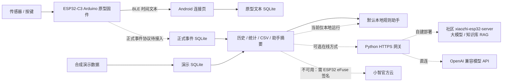

# ESP32 Medication Device

ESP32 用药装置与 Flutter Android App，供 iGEM 原型开发与开源复现。**当前只继续开发 Android；iOS 工程及已有构建记录保留为历史资料，不再作为本轮交付目标。**

**关于小智：Android App 不能用 xiaozhi.me 官方云** —— 官方设备激活要求用 ESP32 eFuse 里的 HMAC 密钥对服务器 challenge 签名，手机做不到，而且官方没有给第三方 App 的聊天 API。可用的两条在线路线是：**自建 `xiaozhi-esp32-server` 的智控台**（大模型、知识库/RAG、角色设定都在那里配），或**直连任意 OpenAI 兼容模型 API**。两者本仓库都已支持。详见[接入可行性](docs/xiaozhi-official-cloud.md)。

## 系统组成



App 侧接口与上游解耦：切换网关上游不需要改 App。官方云这条路线已经核查为**不可用**（需要 ESP32 eFuse 的 HMAC 签名，且官方没有第三方 App 的聊天 API），所以**不要按“等官方云接通”来排期**。

## 当前完成情况

| 模块 | 已实现 | 仍需完成 |
|---|---|---|
| Android App 0.3.0 | A+B 合并、持久化、演示与设备数据隔离、历史/统计/CSV、权限与生命周期处理 | Android 真机整机验收、正式发布签名 |
| BLE 原型 | 扫描、连接、Notify、分片与 CRC、文本落库后 ACK/COMMIT、重试与去重 | 与硬件组逐项实测断线、掉电、重传 |
| 正式事件同步 | 数据模型、事务保存、冲突拒绝、连续位置等 App 基础 | 正式事件解码入库、游标续传、校时、按确认范围回收设备日志 |
| 文字助手 | 本地规则引擎（9 条规则、可单测）；概览页“需要留意”卡片；可选在线助手（网关支持 `mock` / `xiaozhi` / `llm` 三种上游）、摘要发送确认与错误处理 | 真实模型或自建小智服务的端到端验收；知识库 RAG 联调 |
| 小智语音 / iOS | 历史或计划资料保留 | 不属于本轮交付 |

**原型时间文本不会自动成为首页、历史和助手的正式事件统计。** 设备使用动作也不等于已确认服药。本项目为科研原型，不提供诊断或剂量调整功能。

## 从哪里开始

- 小智开发分支、代码入口与验收：[小智成员交接](docs/xiaozhi-developer-handoff.md)。
- 安装、体验与编译：[Android App 说明](mobile_app/README.md)。
- 本轮分工与验收：[Android 开发路线](docs/android-roadmap.md)。
- 连接现有硬件：[A+B 联调说明](docs/member-ab-integration.md)。
- 小智能不能用、怎么配 RAG：[接入可行性与限制](docs/xiaozhi-official-cloud.md)。
- 助手网关的接口与部署（三种上游）：[网关协议](protocol/xiaozhi-bridge.md)、[网关操作说明](server/assistant-gateway/README.md)。
- 本地规则集与安全边界：[助手规则说明](docs/assistant-local-rules.md)、[助手数据需求](docs/assistant-data-requirements.md)。
- 本地专家 vs 联网大模型（含用户自带 Key 的规则）：[模型接入与边界](docs/assistant-model-access.md)。

```bash
git clone https://github.com/zyc-ivsd/esp32-medication-device.git
cd esp32-medication-device
# 本轮开发分支；合入 main 后可直接使用 main。
git switch codex/android-xiaozhi-prep
cd mobile_app
flutter pub get --enforce-lockfile
flutter analyze
flutter test
flutter build apk --debug
```

使用 Flutter 3.47.4、Dart 3.13.3、JDK 17、Android SDK 36；最低 Android 7.0 / API 24。打开 App 导入演示数据即可体验，无需硬件或服务器。Android 自动检查配置见 [.github/workflows](.github/workflows/README.md)，实际通过情况以对应提交的日志为准。

## 仓库目录

| 目录 | 用途 |
|---|---|
| `firmware/` | ESP32-C3 Arduino 原型；S3 / ESP-IDF 是早期目标，尚非可编译迁移工程 |
| `mobile_app/` | Flutter Android 主应用；保留历史 iOS 工程 |
| `protocol/` | BLE 和助手协议，共同接口依据 |
| `server/assistant-gateway/` | 上一阶段可运行的 Python 自建文字网关；团队新目标改为官方云 |
| `tools/python/` | 可选电脑端 BLE 调试工具，App 不依赖它运行 |
| `hardware/`、`samples/` | 硬件资料、示例数据 |
| `docs/` | 当前任务入口及历史交接记录 |

固件入口为 `firmware/esp32-c3/main/main.ino`，烧录前请按硬件组确认的板型、Arduino 库与接线操作。不要把协议目标说明视为固件已实现的证据。

代码采用 [MIT License](LICENSE)；第三方组件遵守各自许可证。不要提交 Token、私钥、个人蓝牙地址或真实用户记录。
